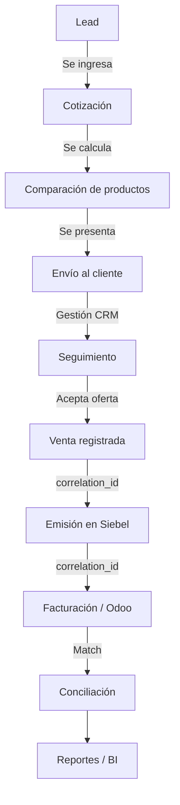

# Ordenanza de Datos

## Cotizador, CRM, Convenios y Emisión

**Proyecto:** Universal Assistance Uruguay
**Versión:** 0.2 (Incluye mejoras de trazabilidad y retención)
**Objetivo:** ordenar la información comercial, operativa y técnica necesaria para cotizar, registrar, comparar, vender, emitir y reportar asistencias al viajero.

---

# 1. Principio general

El sistema debe trabajar bajo una regla central:

## El dato se carga una sola vez

Todo dato ingresado por una vendedora, asesor, sistema web, partner o integración debe poder reutilizarse en las siguientes etapas:

1. Lead.
2. Cotización.
3. Comparación de productos.
4. Envío al cliente.
5. Seguimiento.
6. Venta.
7. Emisión en Siebel.
8. Facturación / conciliación en Odoo.
9. Reportería comercial.
10. Control ISO 9001.

Ningún dato debe pedirse nuevamente si ya fue capturado antes, salvo que sea necesario actualizarlo o validarlo.

---

# 2. Fuentes de datos

## 2.1 Fuentes principales

| Fuente                  | Uso                                                    | Nivel de confianza          |
| ----------------------- | ------------------------------------------------------ | --------------------------- |
| Cotizador web Universal | Productos, precios, promociones, coberturas            | Alto, si se obtiene vía API |
| Portal de Partners      | Productos, precios, lógica comercial, partners         | Alto, si se obtiene vía API |
| Siebel                  | Voucher, emisión, pasajero, producto emitido           | Muy alto                    |
| CRM interno             | Lead, seguimiento, gestión comercial, estado de venta  | Medio / alto                |
| Odoo / sistema contable | Facturación, cobro, conciliación                       | Muy alto                    |
| Planillas internas      | Convenios, reglas, promociones, condiciones especiales | Medio                       |
| Conocimiento del equipo | Criterios comerciales no documentados                  | Bajo hasta ser documentado  |

---

# 3. Datos maestros

Los datos maestros son los datos base que no deberían cambiar todos los días y que deben tener mantenimiento controlado. 

> [!IMPORTANT]
> **Borrado Lógico (Soft Delete):** Nunca se deben eliminar registros físicamente de las tablas maestras. Si un producto, convenio o promoción deja de existir, se usa el campo `activo: false`. Esto garantiza la integridad del historial de cotizaciones y ventas pasadas.

## 3.1 Países y destinos

Cada destino debe tener una estructura única.

| Campo             | Descripción                                        | Obligatorio |
| ----------------- | -------------------------------------------------- | ----------- |
| `destino_id`      | Código interno único                               | Sí          |
| `pais_nombre`     | Nombre del país                                    | Sí          |
| `pais_codigo_iso` | Código ISO si aplica                               | Deseable    |
| `zona_tarifaria`  | Argentina, Sudamérica, Internacional, Europa, etc. | Sí          |
| `activo`          | Si está disponible para cotizar                    | Sí          |

---

## 3.2 Zonas tarifarias

Las zonas tarifarias deben estar separadas del país.

| Campo                         | Descripción              |
| ----------------------------- | ------------------------ |
| `zona_id`                     | Código interno           |
| `nombre`                      | Nombre visible           |
| `descripcion`                 | Alcance comercial        |
| `requiere_destino_especifico` | Sí / No                  |
| `observaciones`               | Aclaraciones comerciales |

---

## 3.3 Productos / planes

Cada producto debe tener un identificador único.

| Campo                     | Descripción                                  | Obligatorio |
| ------------------------- | -------------------------------------------- | ----------- |
| `producto_id`             | Código interno único                         | Sí          |
| `codigo_externo`          | Código en Universal / Siebel / API           | Sí          |
| `nombre_comercial`        | Nombre visible                               | Sí          |
| `tipo_producto`           | Diario, anual, convenio, especial, adicional | Sí          |
| `cobertura_principal_usd` | Monto principal de asistencia médica         | Sí          |
| `activo`                  | Disponible o no (Soft delete)                | Sí          |
| `vigencia_desde`          | Fecha desde                                  | Sí          |
| `vigencia_hasta`          | Fecha hasta                                  | No          |
| `fuente`                  | API, Siebel, manual, partner                 | Sí          |

---

## 3.4 Coberturas y beneficios

Las coberturas deben estar asociadas a productos, no escritas a mano en cada cotización.

| Campo              | Descripción                                      |
| ------------------ | ------------------------------------------------ |
| `beneficio_id`     | Código único                                     |
| `producto_id`      | Producto asociado                                |
| `nombre_beneficio` | Nombre comercial                                 |
| `categoria`        | Médica, equipaje, odontología, cancelación, etc. |
| `valor`            | Monto o texto                                    |
| `moneda`           | USD, UYU, texto                                  |
| `incluido`         | Sí / No                                          |
| `observaciones`    | Condiciones                                      |

---

## 3.5 Convenios

Todo convenio debe estar documentado digitalmente.

| Campo                   | Descripción                               | Obligatorio |
| ----------------------- | ----------------------------------------- | ----------- |
| `convenio_id`           | Código interno                            | Sí          |
| `nombre`                | OCA, Itaú, SMI, MP, oficina, etc.         | Sí          |
| `organizacion_emisora`  | Código o nombre usado en Siebel/cotizador | Sí          |
| `tipo_convenio`         | Banco, salud, empresa, agencia, interno   | Sí          |
| `productos_habilitados` | Lista de productos                        | Sí          |
| `reglas_precio`         | Descuento, tarifa especial o precio fijo  | Sí          |
| `vigencia_desde`        | Fecha inicio                              | Sí          |
| `vigencia_hasta`        | Fecha fin                                 | No          |
| `responsable`           | Persona o área que mantiene el dato       | Sí          |
| `fuente_documental`     | PDF, mail, contrato, planilla             | Sí          |
| `activo`                | Sí / No                                   | Sí          |

---

## 3.6 Promociones

Las promociones deben tener vigencia, condición y fuente.

| Campo              | Descripción                                |
| ------------------ | ------------------------------------------ |
| `promocion_id`     | Código interno                             |
| `nombre`           | Nombre comercial                           |
| `tipo`             | Descuento porcentual, precio fijo, campaña |
| `valor_descuento`  | Porcentaje o monto                         |
| `productos_aplica` | Productos incluidos                        |
| `convenios_aplica` | Convenios incluidos o excluidos            |
| `zonas_aplica`     | Argentina, Sudamérica, Internacional, etc. |
| `vigencia_desde`   | Fecha y hora                               |
| `vigencia_hasta`   | Fecha y hora                               |
| `fuente`           | API, mail, Argentina, manual               |
| `estado`           | Programada, activa, vencida, cancelada     |

---

## 3.7 Adicionales / módulos

Los adicionales deben estar separados del producto principal.

| Campo                   | Descripción                            |
| ----------------------- | -------------------------------------- |
| `adicional_id`          | Código interno                         |
| `nombre`                | Preexistencia, embarazo, deporte, etc. |
| `tipo`                  | Médico, deportivo, extensión, upgrade  |
| `productos_compatibles` | Lista de productos                     |
| `zonas_compatibles`     | Lista de zonas                         |
| `regla_calculo`         | API, manual, tabla, pendiente          |
| `requiere_consulta`     | Sí / No                                |
| `activo`                | Sí / No                                |

---

# 4. Datos transaccionales

Los datos transaccionales son los que se generan durante la gestión comercial.

---

## 4.1 Lead

Un lead es una oportunidad inicial antes de cotizar o vender.

| Campo                   | Descripción                                      | Obligatorio |
| ----------------------- | ------------------------------------------------ | ----------- |
| `lead_id`               | Identificador único                              | Sí          |
| `fecha_creacion`        | Fecha de ingreso                                 | Sí          |
| `fecha_ultimo_contacto` | Última gestión                                   | Sí          |
| `origen`                | Web, teléfono, WhatsApp, agencia, referido       | Sí          |
| `vendedora_asignada`    | Responsable                                      | Sí          |
| `nombre_cliente`        | Nombre                                           | Deseable    |
| `telefono`              | Teléfono                                         | Sí          |
| `email`                 | Mail                                             | Deseable    |
| `destino_estimado`      | Si lo informa                                    | No          |
| `fecha_inicio_viaje`    | Si la informa                                    | No          |
| `estado_lead`           | Nuevo, en gestión, recontactar, vendido, perdido | Sí          |
| `observaciones`         | Comentarios                                      | No          |

---

## 4.2 Cotización

Una cotización es una simulación comercial, no una venta. 

> [!WARNING]
> **Snapshot de Precios (Inmutabilidad):** Al guardar una cotización en el CRM, se debe capturar el `importe_cotizado` y sus detalles como valores fijos. Si los precios en la tabla de Productos cambian mañana, la cotización histórica no debe alterarse.

| Campo                 | Descripción                          | Obligatorio |
| --------------------- | ------------------------------------ | ----------- |
| `cotizacion_id`       | Identificador único                  | Sí          |
| `lead_id`             | Lead asociado                        | Sí          |
| `fecha_cotizacion`    | Fecha de cálculo                     | Sí          |
| `destino_id`          | Destino                              | Sí          |
| `zona_tarifaria`      | Zona calculada                       | Sí          |
| `fecha_inicio`        | Inicio de viaje                      | Sí          |
| `fecha_fin`           | Fin de viaje                         | Sí          |
| `dias`                | Cantidad de días                     | Sí          |
| `cantidad_pasajeros`  | Total pasajeros                      | Sí          |
| `pasajeros`           | Lista de pasajeros/edades            | Sí          |
| `convenio_id`         | Folleto, OCA, Itaú, etc.             | Sí          |
| `productos_ofrecidos` | Lista de productos y su *snapshot*   | Sí          |
| `adicionales`         | Lista de adicionales                 | No          |
| `fuente_precio`       | API, manual, Siebel, planilla        | Sí          |
| `estado_cotizacion`   | Borrador, enviada, aceptada, vencida | Sí          |

---

## 4.3 Pasajeros

Los pasajeros deben estar asociados a cotización y luego a emisión.

| Campo                      | Descripción           |
| -------------------------- | --------------------- |
| `pasajero_id`              | Identificador único   |
| `cotizacion_id`            | Cotización asociada   |
| `nombre`                   | Nombre                |
| `apellido`                 | Apellido              |
| `documento_tipo`           | CI, pasaporte, DNI    |
| `documento_numero`         | Número                |
| `fecha_nacimiento`         | Fecha                 |
| `edad`                     | Calculada             |
| `tipo_pasajero`            | Adulto, menor, mayor  |
| `cliente_existente_siebel` | Sí / No / No validado |

---

## 4.4 Venta

Una venta ocurre cuando el cliente acepta y se inicia el proceso de emisión/cobro.

| Campo             | Descripción                             |
| ----------------- | --------------------------------------- |
| `venta_id`        | Identificador único                     |
| `correlation_id`  | **ID Global para trazabilidad** (Siebel/Odoo) |
| `cotizacion_id`   | Cotización aceptada                     |
| `fecha_venta`     | Fecha de venta                          |
| `vendedora`       | Responsable                             |
| `producto_id`     | Producto vendido                        |
| `convenio_id`     | Convenio aplicado                       |
| `importe_total`   | Importe total vendido                   |
| `moneda`          | USD / UYU                               |
| `estado_venta`    | Vendida, a facturar, facturada, anulada |
| `medio_pago`      | Tarjeta, transferencia, efectivo, otro  |
| `cantidad_cuotas` | Si aplica                               |
| `importe_cuota`   | Si aplica                               |
| `observaciones`   | Comentarios                             |

---

## 4.5 Emisión / voucher

| Campo              | Descripción                   |
| ------------------ | ----------------------------- |
| `emision_id`       | Identificador interno         |
| `venta_id`         | Venta asociada                |
| `voucher_numero`   | Número de voucher             |
| `sistema_emision`  | Siebel, API, manual           |
| `estado_emision`   | Pendiente, emitido, cancelado |
| `fecha_emision`    | Fecha                         |
| `usuario_emisor`   | Persona/sistema               |
| `respuesta_siebel` | Respuesta técnica si aplica   |
| `error_emision`    | Si aplica                     |

---

## 4.6 Facturación / conciliación

| Campo                 | Descripción                                  |
| --------------------- | -------------------------------------------- |
| `facturacion_id`      | Identificador                                |
| `venta_id`            | Venta asociada                               |
| `voucher_numero`      | Voucher                                      |
| `sistema_facturacion` | Odoo u otro                                  |
| `numero_factura`      | Factura                                      |
| `fecha_factura`       | Fecha                                        |
| `importe_facturado`   | Importe                                      |
| `moneda`              | Moneda                                       |
| `estado_facturacion`  | Pendiente, facturado, conciliado, diferencia |
| `diferencia_importe`  | Si aplica                                    |

---

# 5. Reglas de validación

## 5.1 Validaciones obligatorias

1. No puede haber voucher duplicado.
2. No puede haber venta sin producto.
3. No puede haber venta sin importe total.
4. No puede haber cotización sin destino.
5. No puede haber cotización sin fecha de inicio y fin.
6. No puede haber emisión sin venta asociada.
7. No puede haber facturación conciliada sin factura o comprobante.
8. No puede usarse una promoción fuera de vigencia.
9. No puede usarse un convenio inactivo.
10. No puede modificarse una venta facturada sin dejar auditoría.

## 5.2 Validaciones recomendadas

1. Si el destino es Argentina, aplicar zona tarifaria Argentina.
2. Si el destino pertenece a Sudamérica, aplicar zona Sudamérica salvo regla específica.
3. Si el destino no es Argentina ni Sudamérica, aplicar Internacional o la zona correspondiente.
4. Si el pasajero supera determinada edad, validar si cambia tarifa o producto disponible.
5. Si se agrega adicional, validar compatibilidad con producto y zona.
6. Si el convenio tiene productos exclusivos, mostrar solo productos habilitados.
7. Si hay promoción activa, registrar código y vigencia aplicada.
8. Si la cotización fue manual, marcarla como manual y pedir observación.

> [!TIP]
> **Privacidad y Retención de Datos:** Para cumplir con la Ley de Protección de Datos, los leads en estado `PERDIDO` o `NO_RESPONDE` deberían anonimizarse (borrar CI, pasaporte, info médica) automáticamente luego de X tiempo determinado por Legales.

---

# 6. Estados normalizados

## 6.1 Estado del lead

| Estado        | Uso                        |
| ------------- | -------------------------- |
| `NUEVO`       | Lead ingresado sin gestión |
| `EN_GESTION`  | Contacto iniciado          |
| `COTIZADO`    | Se generó cotización       |
| `RECONTACTAR` | Requiere seguimiento       |
| `VENDIDO`     | Terminó en venta           |
| `PERDIDO`     | No compró                  |
| `NO_RESPONDE` | No se logró contacto       |
| `DUPLICADO`   | Lead repetido              |

## 6.2 Estado de cotización

| Estado        | Uso                       |
| ------------- | ------------------------- |
| `BORRADOR`    | Simulación no enviada     |
| `ENVIADA`     | Enviada por mail/WhatsApp |
| `ACEPTADA`    | Cliente acepta            |
| `VENCIDA`     | Fuera de vigencia         |
| `REEMPLAZADA` | Hubo nueva cotización     |
| `CANCELADA`   | Descartada                |

## 6.3 Estado de venta

| Estado           | Uso                            |
| ---------------- | ------------------------------ |
| `VENDIDA`        | Venta registrada               |
| `A_FACTURAR`     | Pendiente de facturación       |
| `FACTURADA`      | Facturada                      |
| `ANULADA`        | Cancelada                      |
| `CON_DIFERENCIA` | Diferencia contra contabilidad |
| `CONCILIADA`     | Coincide con contabilidad      |

## 6.4 Estado de emisión

| Estado      | Uso               |
| ----------- | ----------------- |
| `PENDIENTE` | Voucher pendiente |
| `EMITIDO`   | Voucher emitido   |
| `ERROR`     | Falló emisión (timeout, Siebel down) |
| `CANCELADO` | Voucher cancelado |

> [!NOTE]
> **Mecanismo de Retries (Reintentos):** Para emisiones que caen en estado `ERROR` por problemas temporales de red, debe existir una tarea de fondo (cronjob) que vuelva a intentar sincronizar con Siebel o levante una alerta a Operaciones para conciliación manual.

---

# 7. Propiedad del dato

Cada dato debe tener un responsable.

| Dato         | Responsable sugerido   |
| ------------ | ---------------------- |
| Convenios    | Marketing / Comercial  |
| Promociones  | Marketing / Argentina  |
| Productos    | Comercial / Argentina  |
| Coberturas   | Producto / Argentina   |
| Cotización   | Sistema / API          |
| Venta        | Vendedora              |
| Voucher      | Siebel                 |
| Facturación  | Contabilidad           |
| Conciliación | Contabilidad / Gestión |
| Reportes     | Marketing / Dirección  |

---

# 8. Auditoría

Todo cambio relevante debe guardar:

| Campo                | Descripción                       |
| -------------------- | --------------------------------- |
| `creado_por`         | Usuario que creó                  |
| `fecha_creacion`     | Fecha                             |
| `modificado_por`     | Usuario que modificó              |
| `fecha_modificacion` | Fecha                             |
| `motivo_cambio`      | Motivo                            |
| `valor_anterior`     | Si aplica                         |
| `valor_nuevo`        | Si aplica                         |
| `fuente_cambio`      | Manual, API, importación, sistema |

Aplica especialmente a:
* Importes, Productos, Convenios, Promociones, Estado de venta, Voucher, Facturación, Datos del pasajero.

---

# 9. Normalización de nombres

## 9.1 Reglas de nombres técnicos

Usar nombres claros, en minúscula y con guion bajo (snake_case).
* **Correcto:** `fecha_inicio`, `importe_total`, `numero_voucher`, `estado_venta`, `convenio_id`
* **Incorrecto:** `FechaInicio`, `fechaViaje1`, `importe`, `voucher2`, `estado`

## 9.2 Reglas de nombres visibles

Los nombres visibles deben ser simples para el equipo comercial.
* `fecha_inicio` → **Fecha de inicio**
* `importe_total` → **Importe total**
* `estado_venta` → **Estado de venta**

---

# 10. Modelo mínimo de tablas

## 10.1 Tablas maestras
* `destinos`, `zonas_tarifarias`, `productos`, `beneficios`, `convenios`, `promociones`, `adicionales`, `organizaciones_emisoras`, `vendedoras`

## 10.2 Tablas transaccionales
* `leads`, `cotizaciones`, `cotizacion_productos`, `pasajeros`, `ventas`, `emisiones`, `facturacion`, `seguimientos`, `envios_cliente`

## 10.3 Tablas de control
* `auditoria_cambios`, `importaciones`, `errores_integracion`, `logs_api`, `conciliaciones`

---

# 11. Flujo de datos recomendado

El uso de un `correlation_id` (ID Global) debe viajar durante todo el flujo para garantizar trazabilidad.

---

# 12. Fuente de verdad por dato

| Dato                       | Fuente de verdad               |
| -------------------------- | ------------------------------ |
| Precio final de cotización | API cotizador / fuente oficial |
| Producto emitido           | Siebel                         |
| Voucher                    | Siebel                         |
| Estado comercial           | CRM                            |
| Facturación                | Odoo / Contabilidad            |
| Cobro                      | Odoo / Contabilidad            |
| Convenio vigente           | Base interna validada          |
| Promoción vigente          | API / Argentina                |
| Vendedora responsable      | CRM                            |
| Cliente/pasajero emitido   | Siebel                         |

---

# 13. Reglas para reportes

Los reportes comerciales deben diferenciar:
1. **Ventas registradas en CRM.**
2. **Ventas emitidas en Siebel.**
3. **Ventas facturadas en Odoo.**
4. **Ventas cobradas.**
5. **Ventas conciliadas.**
No deben mezclarse estos conceptos en una única métrica sin aclaración.

## Métricas sugeridas

| Métrica                | Fuente          |
| ---------------------- | --------------- |
| Leads ingresados / contact. | CRM        |
| Cotizaciones enviadas  | CRM             |
| Ventas registradas     | CRM             |
| Vouchers emitidos      | Siebel          |
| Importe vendido        | CRM / Siebel    |
| Importe facturado      | Odoo            |
| Diferencia CRM vs Odoo | Conciliación    |

---

# 14. Priorización de implementación

## Etapa 1: Ordenamiento básico
* Normalizar campos del CRM. Evitar duplicado de voucher.
* Crear tabla digital de convenios y promociones.

## Etapa 2: Cotización estructurada
* Capturar endpoints del cotizador. Identificar catálogo, lógica de destinos y precios.
* Crear modelo propio de cotización.

## Etapa 3: Integración
* Consultar precios vía API. Guardar cotizaciones y enviar por WA/Email.
* Preparar datos para Siebel.

## Etapa 4: Emisión
* Integrar con Siebel si hay API. Recibir número de voucher.
* Actualizar estado de venta y guardar respuesta.

## Etapa 5: Conciliación
* Conectar Odoo. Comparar CRM vs Siebel vs Odoo.
* Crear reportes confiables.

---

# 15. Reglas de gobierno

1. Ningún convenio nuevo se carga sin responsable y fuente documental.
2. Ninguna promoción se carga sin fecha de inicio y fin.
3. Ningún producto se activa sin código externo.
4. Ningún precio manual debe quedar sin observación.
5. Ninguna venta debe tener voucher duplicado.
6. Ningún dashboard debe mezclar vendido, emitido y facturado sin aclarar.
7. Toda modificación de importe debe quedar auditada.
8. Todo dato que venga de API debe guardar fecha de consulta.
9. Todo error de integración debe registrarse.
10. Toda excepción operativa debe transformarse en regla documentada si se repite.

---

# 16. Definición de éxito

La ordenanza se considera aplicada cuando:
1. El equipo carga el dato una sola vez.
2. Las cotizaciones quedan registradas y versionadas inmutablemente.
3. Los convenios están digitalizados.
4. Los precios tienen fuente identificable.
5. Los vouchers no se duplican.
6. Las ventas pueden exportarse limpias (fecha, vendedora, producto, estado).
7. El CRM, Siebel y Odoo pueden conciliarse sin discrepancias "fantasma".
8. Las vendedoras no dependen de memoria para saber qué ofrecer.
9. Los reportes comerciales indican claramente su fuente.
10. El proceso ayuda a vender más rápido, no solo a cumplir con ISO.

---

# 17. Resultado esperado

El sistema debe permitir pasar de una operación basada en múltiples cargas manuales a una operación integrada donde:
* el lead se registra una vez,
* la cotización se genera con datos reutilizables,
* los productos se comparan de forma clara,
* la venta queda trazable end-to-end,
* la emisión se conecta con Siebel,
* la facturación se concilia con Odoo,
* y la gestión comercial puede medirse con datos confiables.

El objetivo no es construir un sistema decorativo, sino una herramienta operativa que reduzca carga manual, errores y tiempos de respuesta.
